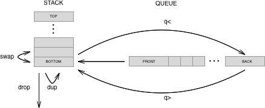
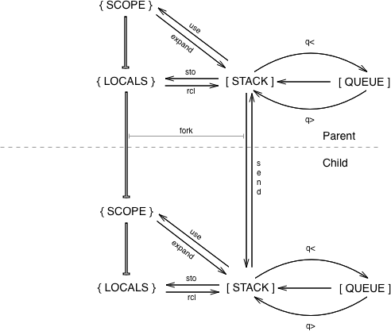

# Components

## The Stack and Queue

Most direct interaction in F♭ will be with the stack and the queue.  In fact, since words are added to the queue before they are executed the user is primarily interacting with the queue.  By convention the last item in the stack is called the bottom, while the first item in the queue is called the front.  New actions are retrieved from the front of the queue \(FIFO\) and executed on the stack.  Stack words \(i.e. `dup`, `swap`, `drop` \) interact with the bottom of the stack \(FILO\).

## The Environment

Words \(and corresponding actions\) in F♭ are stored in a two dictionaries.  Words are stored in the "locals" dictionary.  Due to prototype inheritance,  words are recalled from both the locals dictionary and the "scope" \(as well as the parent as described below\).  Words are added to the scope primarily through importing files.... more on that later.

## Parent / Child

In F♭, a sub-environment may be invoked using the `fork` word.  When a stack is forked it receives it's initial stack content from the bottom of parent's stack \(in the form of an array\) and creates a new dictionary \(scope + locals\) that inherits from the parent.  In this way the child environment has access to all words defined in the parent.  A child can send a value from it's stack to the parent using the `send` verb.

